# Explicação das figuras finais

Guia de leitura das figuras de `outputs/figuras_finais/`, na ordem da narrativa
(conceito → problema → resultado → porquê → validação). Para cada uma: **o que
mostra**, **como ler** e **conclusão**.

---

## 1. Conceito de censura à direita

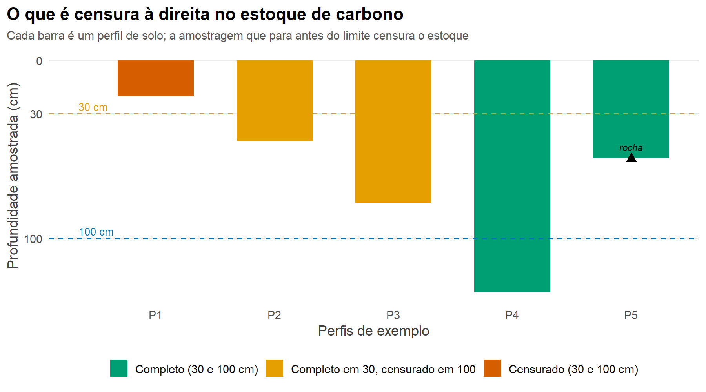

- **O que mostra:** cinco perfis de solo de exemplo (barras verticais de profundidade), com linhas de referência em 30 e 100 cm. A cor indica o status: completo (atingiu o limite ou bateu na rocha) vs. censurado (a amostragem parou antes).
- **Como ler:** a barra que não alcança a linha do limite é censurada naquele limite; a marca de rocha indica solo que terminou (observação completa).
- **Conclusão:** ilustra, sem estatística, o que é censura à direita — a base do problema.

---

## 2. Distribuição espacial dos perfis

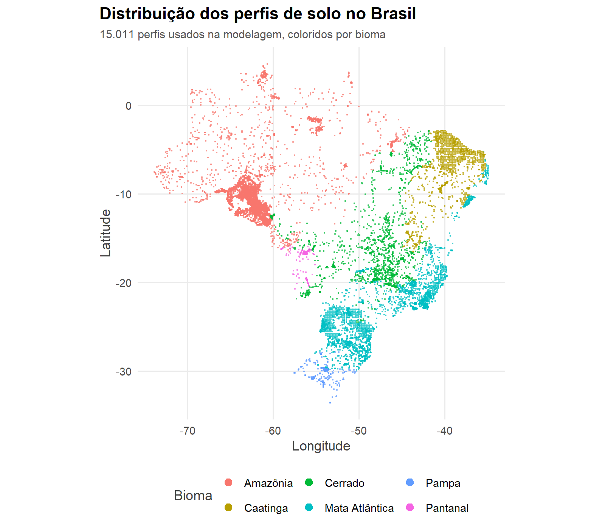

- **O que mostra:** mapa do Brasil; cada ponto é um perfil de solo, colorido por bioma.
- **Como ler:** a densidade e o espalhamento dos pontos indicam a cobertura dos dados.
- **Conclusão:** contextualiza a abrangência e a representatividade dos 15.011 perfis usados na modelagem.

---

## 3. Quanto se perde ignorando o fundo (objetivo específico 1)

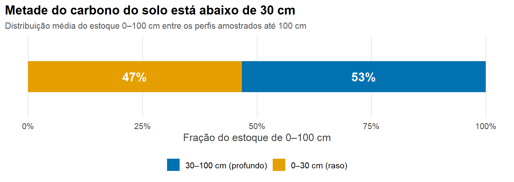

- **O que mostra:** distribuição média do estoque cumulativo 0–100 cm entre os primeiros 30 cm (≈47%) e a faixa 30–100 cm (≈53%).
- **Como ler:** a fração de cada cor é a parte do carbono concentrada naquela profundidade.
- **Conclusão:** cerca de metade do carbono está abaixo de 30 cm — por isso ignorar a censura subestima fortemente o estoque.

---

## 4. Benchmark — CCC por modelo

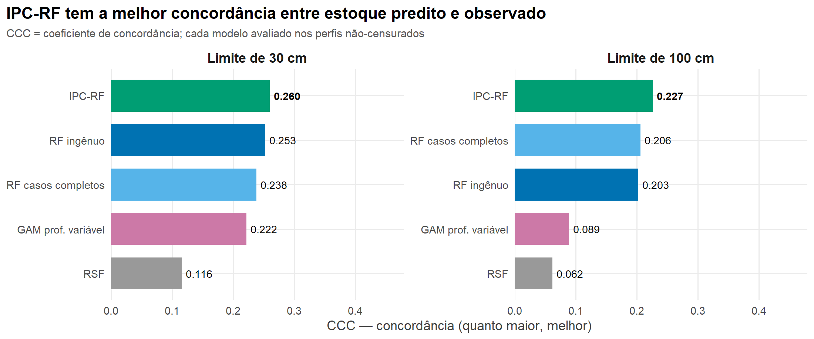

- **O que mostra:** o Coeficiente de Correlação de Concordância (CCC) de cada modelo, em dois painéis (30 e 100 cm), avaliado nos perfis não-censurados.
- **Como ler:** quanto maior a barra, melhor a concordância entre estoque predito e observado.
- **Conclusão:** o **IPC-RF vence nos dois limites** — é o resultado central do trabalho.

---

## 5. Observado vs. predito do IPC-RF (o vencedor)

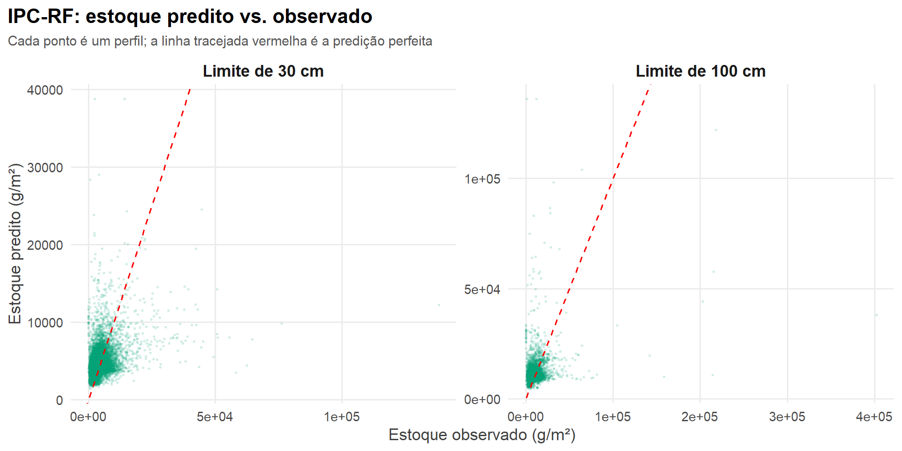

- **O que mostra:** dispersão do estoque predito (y) contra o observado (x) do IPC-RF, em dois painéis; a linha tracejada vermelha é a predição perfeita.
- **Como ler:** pontos próximos da diagonal = acerto; nuvem em torno dela = erro.
- **Conclusão:** há correlação clara, mas a predição é imperfeita — o problema é intrinsecamente difícil.

---

## 6. Anatomia do CCC — por que o RSF perde

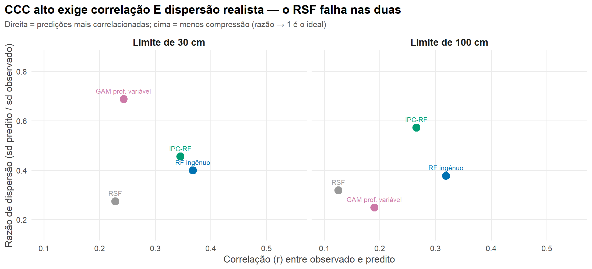

- **O que mostra:** cada modelo é um ponto — eixo x = correlação (r) entre observado e predito; eixo y = razão de dispersão (desvio-padrão do predito / desvio-padrão do observado). Dois painéis (30 e 100 cm).
- **Como ler:** o ideal é o canto **superior-direito** (alta correlação e dispersão realista); o canto inferior-esquerdo é o pior.
- **Conclusão:** o **RSF** fica no canto inferior-esquerdo nos dois limites — falha nas duas dimensões (comprime as predições e correlaciona pouco). É a explicação do seu baixo desempenho.

---

## 7. Ajuste da distribuição (compressão do sinal)

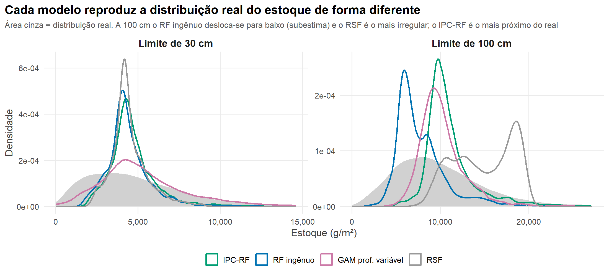

- **O que mostra:** curvas de densidade do estoque **predito** por cada modelo sobrepostas à **distribuição real** (área cinza), em dois painéis.
- **Como ler:** curva mais estreita = predições comprimidas; curva deslocada à esquerda = subestima.
- **Conclusão:** a 100 cm, o RF ingênuo desloca-se para baixo (viés de censura) e o IPC-RF é o mais próximo do real; o RSF é o mais irregular.

---

## 8. Observado vs. predito — os quatro modelos

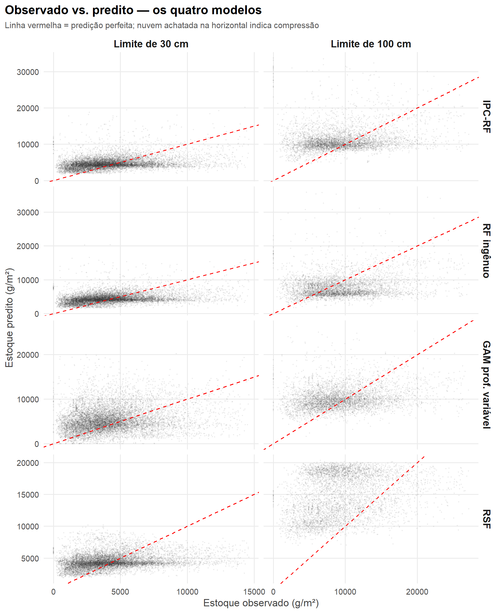

- **O que mostra:** grade de 4 modelos × 2 limites; cada célula é a dispersão observado vs. predito, com a diagonal vermelha da predição perfeita.
- **Como ler:** nuvem "deitada" na horizontal = compressão (predições quase constantes enquanto o real varia).
- **Conclusão:** evidência visual do achatamento — o RSF a 100 cm vira um borrão sem correlação; o RF ingênuo forma uma banda baixa (subestima).

---

## 9. Como o IPC-RF corrige a censura

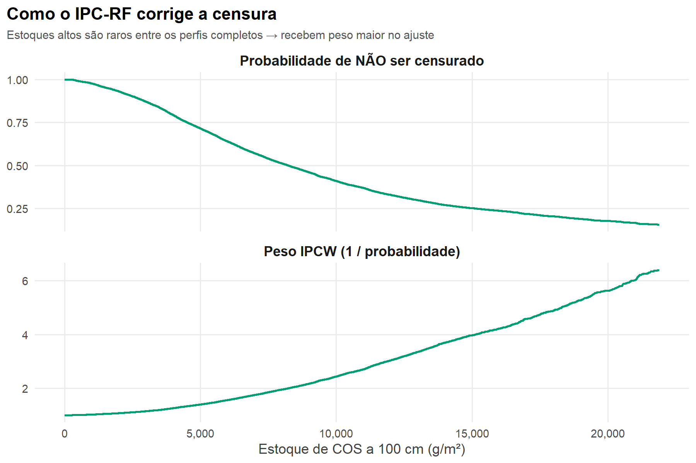

- **O que mostra:** dois painéis — (cima) Ĝ, a probabilidade de **não** ser censurado, que **cai** conforme o estoque cresce; (baixo) o peso IPCW = 1/Ĝ, que **sobe**. Ambos vs. o estoque a 100 cm.
- **Como ler:** estoques altos, raros entre os perfis completos, ficam com Ĝ baixo e, portanto, peso alto.
- **Conclusão:** é o mecanismo da correção — o IPC-RF dá mais peso às observações completas de estoque alto, compensando as que foram perdidas pela censura.

---

## 10. A correção funciona? (validação com verdade medida)

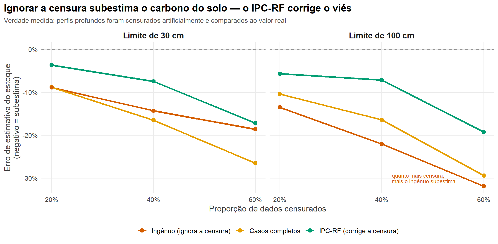

- **O que mostra:** viés relativo (%) no eixo y vs. a proporção de censura imposta (20/40/60%) no x, para três métodos (ingênuo, casos completos, IPC-RF), em dois painéis. A linha tracejada em 0 é o ideal. A censura é imposta artificialmente sobre perfis reais profundos, comparando ao valor medido.
- **Como ler:** abaixo de 0 = subestima; mais perto de 0 = melhor.
- **Conclusão:** o ingênuo e os casos-completos subestimam cada vez mais (o ingênuo chega a −32% a 100 cm com 60% de censura); o **IPC-RF mantém o menor viés** em todos os cenários.

---

## 11. (Extra) Como o alvo é montado até o limite

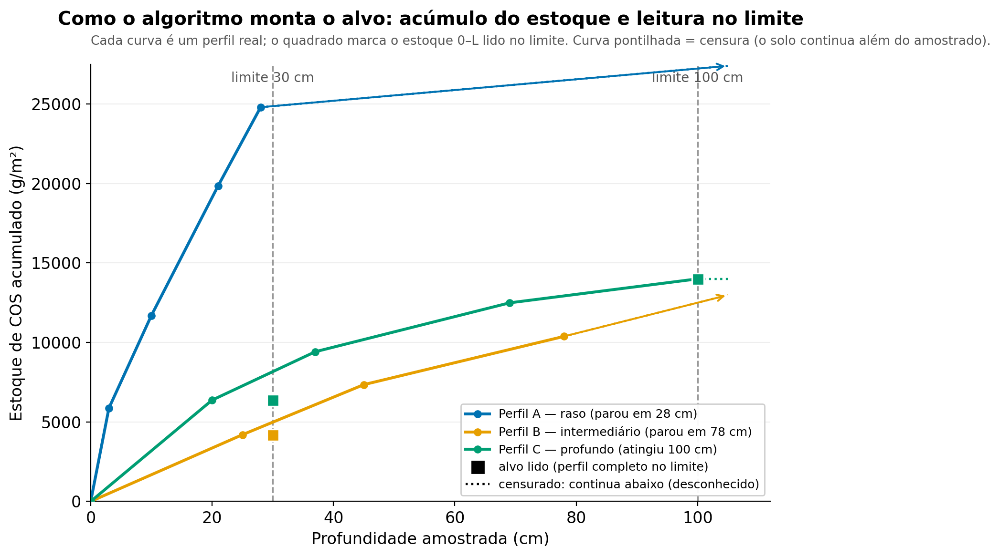

- **O que mostra:** curvas de acúmulo do estoque por profundidade em perfis reais, com as linhas de 30 e 100 cm e a leitura do alvo em cada limite; a continuação pontilhada indica censura (o solo continua abaixo do amostrado).
- **Como ler:** onde a curva cruza o limite, lê-se o estoque 0–L; se a curva termina antes, o perfil é censurado.
- **Conclusão:** ilustra a lógica de "montar o alvo" e onde entra a censura. Figura auxiliar — opcional para o texto.
